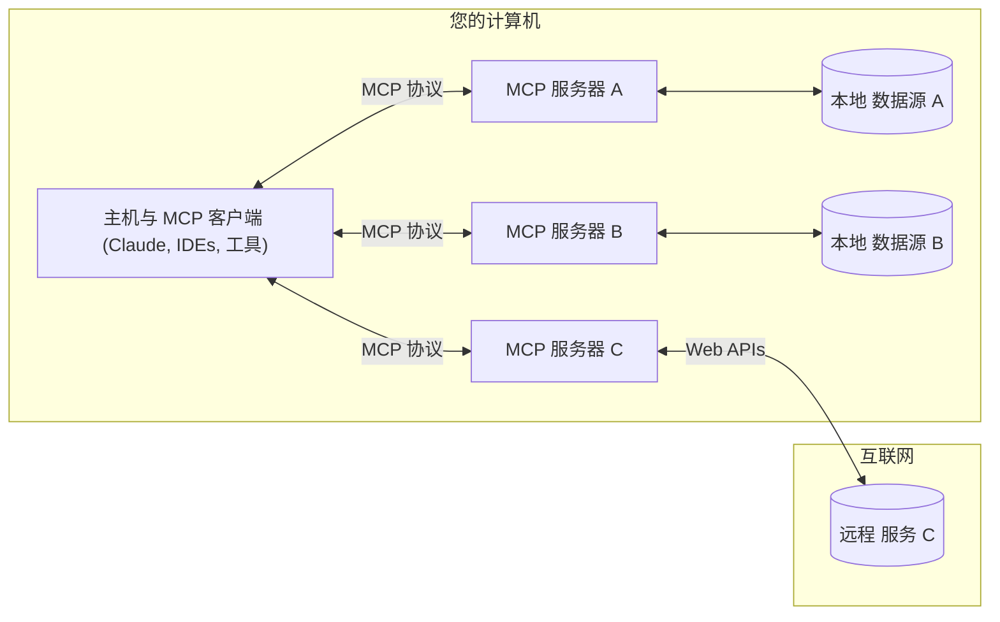

---
# You can also start simply with 'default'
theme: default
# random image from a curated Unsplash collection by Anthony
# like them? see https://unsplash.com/collections/94734566/slidev
background: images/pc-coding.webp
# some information about your slides (markdown enabled)
title: mcp-in-coding
info: |
  ## Slidev Starter Template
  Presentation slides for developers.

  Learn more at [Sli.dev](https://sli.dev)
# apply unocss classes to the current slide
class: text-center
# https://sli.dev/features/drawing
drawings:
  persist: false
# slide transition: https://sli.dev/guide/animations.html#slide-transitions
transition: slide-left
# enable MDC Syntax: https://sli.dev/features/mdc
mdc: true
# open graph
# seoMeta:
#  ogImage: https://cover.sli.dev

# 设置字体，只使用本地字体
fonts:
  provider: none
  sans: 'LXGW WenKai,PingFang SC, Microsoft YaHei, SimHei, Arial, sans-serif'
  serif: 'Songti SC, SimSun, Georgia, Times New Roman, serif'
  mono: 'JetBrains Mono, SF Mono, Monaco, Consolas, Liberation Mono, Menlo, Courier New, monospace'
---

# MCP在编程开发中的应用

<div @click="$slidev.nav.next" class="mt-12 py-1" hover:bg="white op-10">
  按下空格：Let's Go <carbon:arrow-right />
</div>

<!--
The last comment block of each slide will be treated as slide notes. It will be visible and editable in Presenter Mode along with the slide. [Read more in the docs](https://sli.dev/guide/syntax.html#notes)
-->


---
layout: two-cols-header
---

# 引子

::left::


::right::


---
transtion: fade-out
---

# 什么是MCP?

<span v-mark.green="{ at: 1, type: 'circle' }">MCP</span><span v-mark="{ at: 2, color: '#d52753', type: 'underline' }"> （Model Context Protocol，模型上下文协议）</span>

🔗 **一个开放标准协议，让AI模型能够安全地访问外部数据和工具**



<style>
h1 {
  background-color:rgb(77, 111, 225);
  background-image: linear-gradient(45deg,#146b8c,rgb(107, 122, 237) 10% 20%);
  background-size: 100%;
  -webkit-background-clip: text;
  -moz-background-clip: text;
  -webkit-text-fill-color: transparent;
  -moz-text-fill-color: transparent;
}
</style>


---
transition: fade-out
---


# 什么是MCP?

<span v-mark.green="{ at: 1, type: 'circle' }">MCP</span><span v-mark="{ at: 2, color: '#d52753', type: 'underline' }"> （Model Context Protocol，模型上下文协议）</span>

MCP的核心概念包括：

- 📊 **Resources 资源** - 模型可以读取的数据源（文件、数据库记录、API响应等）
- 💬 **Prompts 提示词** - 可重用的提示模板，帮助模型理解特定任务
- 🛠 **Tools 工具** - 模型可以调用的函数或API，执行具体操作
- 🎯 **Sampling 采样** - 让MCP服务器代表客户端请求LLM完成任务
- 📁 **Roots 根目录** - 定义MCP服务器可以访问的文件系统边界
- 🌐 **Transports 传输层** - 客户端与服务器之间的通信机制（stdio、HTTP、WebSocket等）
<br>
<br>

官方文档： [MCP](https://modelcontextprotocol.io/introduction)


<style>
h1 {
  background-color:rgb(77, 111, 225);
  background-image: linear-gradient(45deg,#146b8c,rgb(107, 122, 237) 10% 20%);
  background-size: 100%;
  -webkit-background-clip: text;
  -moz-background-clip: text;
  -webkit-text-fill-color: transparent;
  -moz-text-fill-color: transparent;
}
</style>


---
layout: two-cols
---

# VSCode配置

在项目目录中新建文件`.vscode/mcp.json`

```json
{
    "servers": {
        "my-mcp-server-fb2cfdd3": {
            "url": "http://localhost:3000/mcp"
        },
        "playwright": {
            "command": "npx",
            "args": [
                "@playwright/mcp@latest"
            ]
        }
    }
}
```

::right::


<!-- Inline style -->
<style>
.footnotes-sep {
  @apply mt-5 opacity-10;
}
.footnotes {
  @apply text-sm opacity-75;
}
.footnote-backref {
  display: none;
}
.my-img{
  @apply mt-20 ml-7;
}
</style>

<!--
Notes can also sync with clicks

[click] This will be highlighted after the first click

[click] Highlighted with `count = ref(0)`

[click:3] Last click (skip two clicks)
-->

---
layout: two-cols
---

# 使用playwright进行页面自动化测试

Prompt:
```txt
启动当前项目，
然后在浏览器中进行点击测试，
测试计数器和动态列表页面功能是否异常。
测试过程中请截图网页，并记录页面所有的日志报错信息，
最终在testlog目录下保存测试报告、日志和截图文件。
```

::right::


<style>
.my-img {
  @apply mt-10 ml-7;
}
</style>

---
layout: two-cols
---

# 使用letv-wiki-server进行知识库检索

Prompt:
```txt
我需要一些关于 观星系统和媒咨系统 的信息，
请从乐视知识库中搜索相关信息并汇总。
将总结好的信息保存到letv.md中。
```

::right::


<style>
.my-img {
  @apply mt-1 ml-20;
  height: 50vh;
  width: auto;
}
</style>


---
layout: center
class: text-center
---

# 参考链接

[在 VS Code 中使用 MCP 服务器](https://vscode.js.cn/docs/copilot/chat/mcp-servers)

[MCP编程极速入门](https://github.com/liaokongVFX/MCP-Chinese-Getting-Started-Guide)

[Awesome-MCP-ZH](https://github.com/yzfly/Awesome-MCP-ZH)

[MCP Explained: The New Standard Connecting AI to Everything](https://medium.com/@elisowski/mcp-explained-the-new-standard-connecting-ai-to-everything-79c5a1c98288)


<PoweredBySlidev mt-10 />
